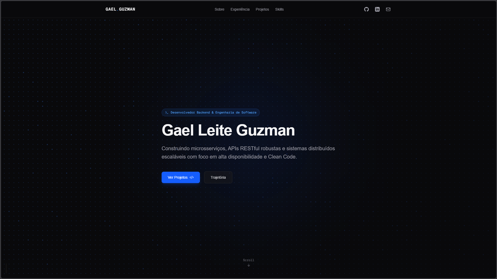
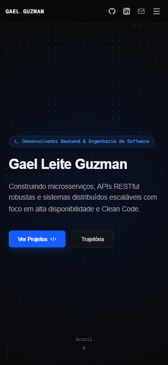

# Portfólio Pessoal — Gael Guzman

[](https://nextjs.org/)
[](https://react.dev/)
[](https://www.typescriptlang.org/)
[](https://tailwindcss.com/)

Aplicação web moderna, interativa e de alta performance desenvolvida para apresentar minha trajetória, projetos de engenharia de software e habilidades técnicas no ecossistema de desenvolvimento de software (Backend, Microsserviços e Web Full-Stack).

---

## Demonstração & Prints do Projeto

### Desktop View


### Mobile View (Responsivo)
<div align="center">
  
</div>

---

## Seções da Aplicação

- **Hero / Apresentação:** Apresentação inicial com fundo animado em Canvas HTML5 (`<DotField/>`), interativo com o movimento do cursor e visual escuro com estética de terminal.
- **Sobre Mim:** Resumo profissional focando em Engenharia de Software, arquitetura e construção de APIs RESTful.
- **Experiência Profissional:** Linha do tempo detalhando atuações no mercado (como desenvolvedor freelance) e formação acadêmica (Fatec / Etec).
- **Projetos em Destaque:** Lista de sistemas desenvolvidos (Orquestra Queue System, FinWise, FuraFila Digital, etc.), com cartões animados e suporte a páginas individuais de detalhes.
- **Página de Detalhes do Projeto (`/projects/[slug]`):** Roteamento dinâmico que apresenta galeria de imagens com proporção natural, tags técnicas, links para repositórios GitHub/Live Demo, visão geral do sistema e especificações de arquitetura.
- **Tecnologias & Skills:** Ecossistema de habilidades categorizado em Linguagens, Frontend, Backend, Banco de Dados/ORM, Filas/Serviços e DevOps.
- **Navegação Responsiva:** Header com transições fluidas e menu hambúrguer animado no mobile via `motion`.

---

## Tecnologias & Ferramentas

### Core & Framework
- **[Next.js](https://nextjs.org/):** App Router, Server Components e Static Site Generation (SSG) para alta velocidade de carregamento.
- **[React](https://react.dev/):** Biblioteca principal para renderização e gerenciamento de estado.
- **[TypeScript](https://www.typescriptlang.org/):** Tipagem estática rigorosa para segurança e previsibilidade do código.

### Interface & Animações
- **[Tailwind CSS](https://tailwindcss.com/):** Estilização utilitária de modo escuro com design responsivo.
- **[Motion (Framer Motion)](https://motion.dev/):** Animações de entrada, transições de páginas e componentes interativos.
- **[Lucide React](https://lucide.dev/):** Pacote de ícones minimalistas.

### Tooling & Deploy
- **[Turbopack](https://nextjs.org/docs/app/api-reference/turbopack):** Bundler ultrarrápido para desenvolvimento.
- **[Vercel](https://vercel.com/):** Hospedagem e CI/CD automatizado conectado à branch `main`.
- **ESLint & Prettier:** Padronização da formatação e qualidade do código.

---

## Estrutura de Pastas

```text
portfolio/
├── public/                # Imagens estáticas, prints e artes dos projetos
├── src/
│   ├── app/               # Next.js App Router (Páginas e rotas dinâmicas)
│   │   ├── page.tsx       # Landing page principal
│   │   └── projects/      # Rota dinâmica [slug] para detalhes de cada projeto
│   ├── components/        # Componentes Reutilizáveis de UI
│   │   ├── Navbar.tsx     # Menu de navegação responsivo
│   │   ├── Hero.tsx       # Seção principal de entrada
│   │   ├── TechStack.tsx  # Seção de habilidades por categoria
│   │   └── ui/            # Componentes gráficos (DotField canvas, etc.)
│   └── data/              # Arquivos JSON/TS com dados mockados (profile e projetos)
├── tailwind.config.ts     # Configurações do Tailwind CSS
└── package.json           # Dependências e scripts do projeto
```

## Como Executar o Projeto Localmente
### Pré-requisitos
- Node.js v18 ou superior instalado.
- Gerenciador de pacotes npm, yarn ou pnpm.

### Passo a Passo
1. Clone o repositório:
```bash
git clone https://github.com/galesTV/portfolio-galesTV.git
cd portfolio-galesTV
```

2. Instale as dependências:
```bash
npm install
```

3. Inicie o servidor de desenvolvimento:
```bash
npm run dev
```

4. Acesse no navegador:
Abra http://localhost:3000 para visualizar a aplicação em execução.

5. Testar o build de produção:
```Bash
npm run build
npm run start
```

## Licença
Este projeto está sob a licença MIT. Veja o arquivo para mais detalhes.
