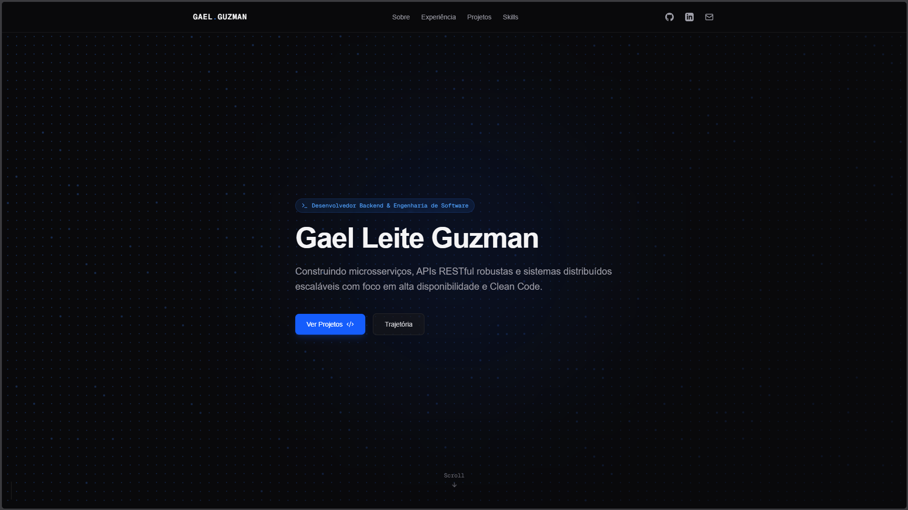
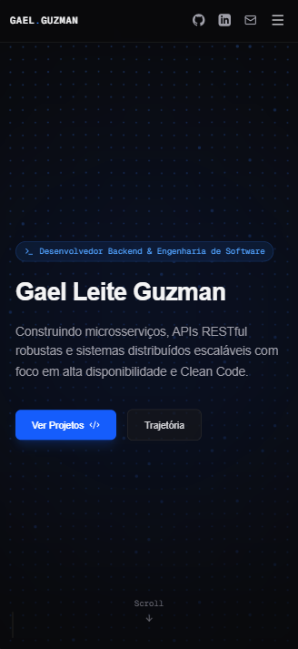

# Portfólio Pessoal — Gael Guzman

[](https://nextjs.org/)
[](https://react.dev/)
[](https://www.typescriptlang.org/)
[](https://tailwindcss.com/)

Portfólio pessoal de Gael Guzman, desenvolvido para apresentar sua trajetória, projetos de software e experiência com desenvolvimento backend e web full-stack.

---

## Demonstração & Prints do Projeto

### Desktop View


### Mobile View (Responsivo)
<div align="center">
  
</div>

---

## Seções da Aplicação

- **Hero / Apresentação:** apresentação inicial com identidade visual e introdução profissional.
- **Sobre Mim:** contexto profissional e trajetória de desenvolvimento.
- **Experiência Profissional:** linha do tempo com experiências e formação.
- **Projetos em Destaque:** projetos de software com páginas individuais de detalhes.
- **Página de Detalhes do Projeto (`/projects/[slug]`):** informações do projeto, tecnologias, arquitetura, galeria e links relacionados.
- **Tecnologias & Skills:** tecnologias organizadas por área de atuação.
- **Navegação Responsiva:** navegação adaptada para desktop e dispositivos móveis.

---

## Tecnologias & Ferramentas

### Core & Framework
- **[Next.js](https://nextjs.org/):** App Router, Server Components e geração estática.
- **[React](https://react.dev/):** biblioteca principal da interface.
- **[TypeScript](https://www.typescriptlang.org/):** tipagem estática para maior previsibilidade do código.

### Interface & Animações
- **[Tailwind CSS](https://tailwindcss.com/):** estilização utilitária e responsiva.
- **[Motion](https://motion.dev/):** animações e transições de interface.
- **[Lucide React](https://lucide.dev/):** biblioteca de ícones.

### Tooling & Deploy
- **[Turbopack](https://nextjs.org/docs/app/api-reference/turbopack):** bundler utilizado no desenvolvimento.
- **[Vercel](https://vercel.com/):** hospedagem e CI/CD.
- **ESLint:** análise estática e qualidade do código.

---

## Estrutura de Pastas

```text
portfolio/
├── public/                # Imagens estáticas, prints e artes dos projetos
├── src/
│   ├── app/               # Next.js App Router
│   │   ├── page.tsx       # Landing page principal
│   │   └── projects/      # Rota dinâmica [slug]
│   ├── components/        # Componentes reutilizáveis de UI
│   │   ├── Navbar.tsx     # Menu de navegação responsivo
│   │   ├── Hero.tsx       # Seção principal de entrada
│   │   ├── TechStack.tsx  # Seção de tecnologias
│   │   └── ui/            # Componentes visuais auxiliares
│   └── data/              # Dados do perfil e projetos
└── package.json           # Dependências e scripts
```

## Como Executar o Projeto Localmente

### Pré-requisitos
- Node.js v18 ou superior.
- Gerenciador de pacotes npm, yarn ou pnpm.

### Passo a Passo

1. Clone o repositório:
```bash
git clone https://github.com/galesTV/portfolio-galesTV.git
cd portfolio-galesTV
```

2. Instale as dependências:
```bash
npm install
```

3. Inicie o servidor de desenvolvimento:
```bash
npm run dev
```

4. Acesse http://localhost:3000.

5. Para testar o build de produção:
```bash
npm run build
npm run start
```

## Licença

Este projeto está sob a licença MIT. Veja o arquivo `LICENSE`.
